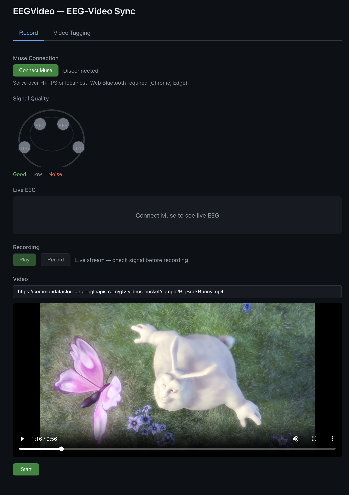
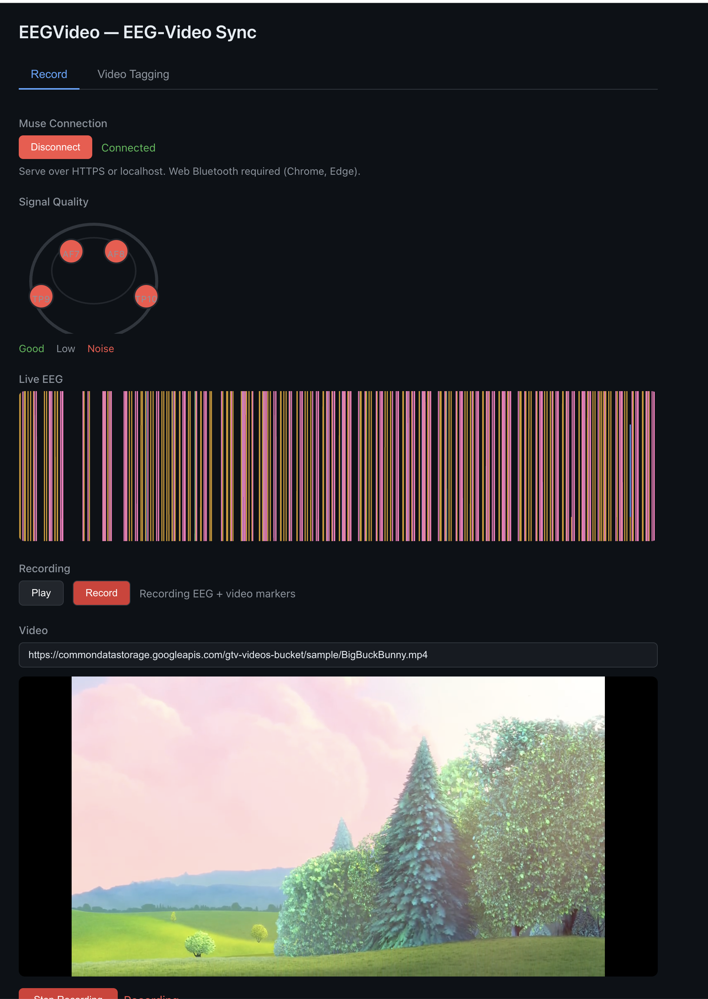

# EEGVideo — EEG-Video Sync

Record EEG from a [Muse](https://choosemuse.com/) headband while watching a video, with synchronized timing markers for frame-accurate alignment.


*App before connecting the Muse headband*


*App with Muse connected, showing live EEG and active recording*

## Features

- **Muse connection** via Web Bluetooth — works with Muse 2, Muse S, and Muse 2016
- **Signal quality** head map showing electrode contact (TP9, AF7, AF8, TP10)
- **Live EEG** 4-channel chart (2 s window, 256 Hz)
- **Synchronized recording** — EEG samples and video timing markers (button press, first frame, periodic frame markers) saved to a single CSV
- **Video Tagging tab** — replay recorded video at 0.5x/1x/2x, step through frames, add manual markers, scene detection, import/export markers

## Prerequisites

- **Node.js 18+** (see `.nvmrc`)
- **Chrome or Edge** (Web Bluetooth is required)
- The app must be served over **HTTPS or localhost**
- A **Muse headband** (Muse 2, Muse S, or Muse 2016)

## Installation

```bash
cd EEGVideo
npm install
```

## Usage

### 1. Start the dev server

```bash
npm run dev
```

Open the URL shown in the terminal (default: `http://localhost:5173`).

### 2. Connect your Muse

1. Turn on your Muse headband.
2. Click **Connect Muse** in the app.
3. Select your device from the browser's Bluetooth pairing dialog.
4. The status will change to **Connected** and the Signal Quality head map will update.

> **Tip:** If the headband won't pair, open the official Muse app on your phone first, connect once, then disconnect and try the web app again.

### 3. Check signal quality

The head diagram shows electrode quality with color coding:

| Color | Meaning |
|-------|---------|
| **Green** | Good signal (1.5–10 µV std dev) |
| **Gray** | Low / no signal |
| **Red** | Noisy signal |

Adjust the headband until all four electrodes are green before recording.

### 4. Set up the video

Paste a video URL into the **Video** input field (any URL that the browser can play as an HTML5 video). A sample video is pre-filled for testing.

### 5. Record

1. Click **Record** to switch from live-stream mode to recording mode.
2. Click **Start** below the video to begin playback and recording simultaneously.
3. EEG samples, video frame timestamps, and event markers are buffered and flushed to a combined CSV every 2 seconds.
4. Click **Stop Recording** to finish. The CSV is downloaded automatically.

### 6. Tag the video (optional)

Switch to the **Video Tagging** tab to:

- Replay the video at different speeds (0.5x, 1x, 2x)
- Step forward/backward frame-by-frame
- Add semantic markers at specific timestamps
- Run automatic scene detection
- Export/import marker sets

## Output format

The recording produces a single CSV with interleaved rows:

- **EEG rows** — `timestamp, TP9, AF7, AF8, TP10`
- **Marker rows** — `timestamp, marker_type, value` (types: `video_start`, `frame`, `button_press`, `semantic`)

## Production build

```bash
npm run build
npm run preview
```

## Tech stack

| Technology | Role |
|------------|------|
| React 18 | UI components |
| Vite 5 | Dev server and bundler |
| muse-js | Muse headband connection and EEG decoding |
| RxJS 7 | Reactive EEG data streams and pipes |

## Contributing

Contributions are welcome! Please feel free to submit a Pull Request.
