# EEGVideo MVP — EEG-Video Sync with Muse 2

## Architecture Overview

```mermaid
flowchart TB
    subgraph UI [React UI]
        Tab1[Main Tab: Record]
        Tab2[Tagging Tab: Semantic Markers]
    end
    
    subgraph DataFlow [RxJS Data Flow]
        MuseSource[Muse Client]
        MuseSource --> eegPipe[eegReadings Observable]
        eegPipe --> Reshape[reshapeToEpoch]
        Reshape --> Quality[addSignalQuality]
        Quality --> Live[Live Display]
        Quality --> Record[Record Buffer]
    end
    
    subgraph Video [Video Pipeline]
        VideoEl[HTML5 Video]
        VideoEl --> RVFC[requestVideoFrameCallback]
        RVFC --> Markers[Frame/Audio Markers]
    end
    
    subgraph Persist [Crash-Resistant Persist]
        Record --> DataFile[EEG data file]
        Markers --> MarkerFile[Marker file]
    end
    
    Tab1 --> DataFlow
    Tab1 --> Video
    Tab2 --> Video
```



---

## 1. Project Setup

**Folder:** `EEGVideo/` (new, sibling to project root)

**Stack:**
- **React 18** + **Vite** (fast dev, ESM)
- **RxJS 7** for observable streams
- **muse-js** (urish/muse-js or kylemath/muse-js) via npm
- **@neurosity/pipes** for `addSignalQuality` and epoch/buffer operators

**Structure:**
```
EEGVideo/
├── index.html
├── package.json
├── vite.config.js
├── src/
│   ├── main.jsx
│   ├── App.jsx
│   ├── App.css
│   ├── index.css
│   ├── config/
│   │   └── constants.js
│   ├── streams/
│   │   ├── museStream.js
│   │   ├── museMinimal.js
│   │   ├── eegPipes.js
│   │   └── recordingStream.js
│   ├── components/
│   │   ├── MuseConnect.jsx
│   │   ├── SignalQualityHead.jsx
│   │   ├── LiveEEGChart.jsx
│   │   ├── VideoPlayer.jsx
│   │   ├── RecordControls.jsx
│   │   └── VideoTaggingTab.jsx
│   └── utils/
│       ├── videoTiming.js
│       ├── dataFormat.js
│       └── sceneDetection.js
```

**Config constants:** EEG_SAMPLE_RATE: 256, EEG_CHANNELS, FRAME_MARKER_INTERVAL, AUDIO_MARKER_INTERVAL, DATA_FLUSH_INTERVAL_MS

---

## 2. Muse Connection (Muse 2, 2018)

- **Subscribe before `start()`** — Muse may emit immediately on `start()`.
- **Serve over HTTPS or localhost** — Web Bluetooth blocked on `file://`.
- **PPG disabled** — Keep `enablePpg: false` for compatibility.
- **Telemetry UUID fallback** — If 273e000b not found, use minimal client (Control + EEG only).

---

## 3. Signal Quality Visualization

Head diagram (SVG) with TP9, AF7, AF8, TP10. Quality from std dev; good range 1.5–10 µV.

---

## 4. Video Timing and Markers

- Button press, first frame, audio start captured.
- `requestVideoFrameCallback` for frame-accurate timing.
- Markers: video_start, frame (every Nth), button_press.

---

## 5. Two Modes: Play vs Record

| Mode | Behavior |
|------|----------|
| Play | Live EEG, signal quality, video preview |
| Record | Buffer EEG, write markers, incremental save |

---

## 6. Data and Marker File Format

EEG: `uncorrected_time,corrected_time,TP9,AF7,AF8,TP10`
Markers: `type,media_time,performance_time,description`

---

## 7. Secondary Tab: Video Tagging

Speeds (0.5x, 1x, 2x), frame-step, manual markers, scene detection, export/import.

---

## 8. RxJS Pipe Architecture

`eegWithQuality()`, `zipSamples`, pipeable operators. Shared streams for live display and recording.

---

## 9. Multi-Agent Execution Plan

M1: Foundation → M2: Visualization, M4: Tagging → M3: Video & Recording

---

## 10. Muse Connection Troubleshooting

- Subscribe before start
- muse-js via npm (not CDN)
- Minimal fallback for telemetry UUID error
- Connect to Muse app first if issues persist

---

## 11. UX Guidelines

Minimal, modern. Single Connect Muse button. Clear Play/Record modes.

---

## 12. Key Files

museStream.js, museMinimal.js, eegPipes.js, SignalQualityHead.jsx, VideoPlayer.jsx, videoTiming.js, dataFormat.js

---

## 13. Testing Assumptions

Muse 2 (2018): 4 channels, 256 Hz. Web Bluetooth (Chrome, Edge). Secure context required.
